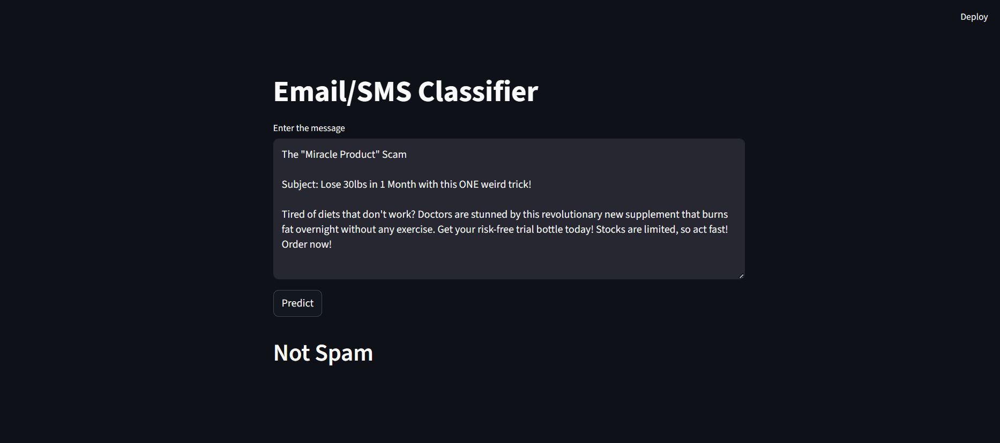

# Spam Message Classifier

A simple web application built with Streamlit and Scikit-learn to classify messages as "Spam" or "Not Spam" (Ham). This project uses a basic Natural Language Processing (NLP) pipeline to preprocess text and a Naive Bayes classifier to make predictions.

## Demo

Here is a look at the application in action:

## Features

-   Real-time message classification.
-   A user-friendly web interface powered by Streamlit.
-   Text preprocessing including lowercasing, tokenization, and stopword removal.
-   Uses a Count Vectorizer and a Multinomial Naive Bayes model for prediction.

## Technologies Used

-   **Python**
--  **Scikit-learn:** For machine learning (CountVectorizer, MultinomialNB).
-   **NLTK:** For natural language processing (stopwords, tokenization).
-   **Streamlit:** For creating the interactive web application.

## How to Run This Project Locally

Follow these steps to get the application running on your local machine.

### 1. Clone the Repository
### 2. Create and Activate a Virtual Environment

        It's recommended to use a virtual environment to keep project dependencies isolated.

### 3. Install Required Packages

Install all the necessary libraries from the `requirements.txt` file.
			
	pip install -r requirements.txt

### 4. Download NLTK Data

The application requires specific datasets from the NLTK library. Run the following commands in a Python interpreter:

	import nltk
	nltk.download('punkt')
	nltk.download('stopwords')

### 5. Run the Streamlit App

Now you are all set to run the application!

The application will open in a new tab in your web browser.

